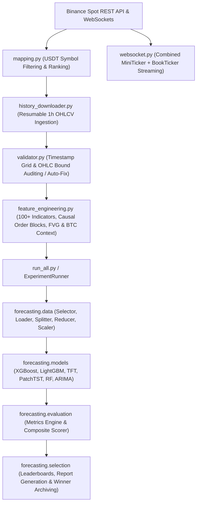

# 🚀 Cryptocurrency Forecasting Engine & Data Pipeline (`project-2day`)

A production-grade, GPU-accelerated time-series data collection, feature engineering, and forecasting benchmark system for cryptocurrency markets.

---

## 📌 Overview

**`project-2day`** is an end-to-end framework designed to ingest, clean, feature-engineer, and model historical and real-time cryptocurrency market data from Binance Spot. It benchmarks state-of-the-art machine learning and deep learning forecasting architectures across **5 prediction horizons** ($1\text{d}, 7\text{d}, 14\text{d}, 30\text{d}, 90\text{d}$) while maintaining strict zero-data-leakage constraints.

---

## 🏗️ Architecture & Data Lifecycle



---

## ✨ Key Features

### 1. Data Ingestion & Real-Time Streaming
* **Resumable History Downloader** ([history_downloader.py](file:///h:/project-2day/history_downloader.py)): Fetches 1h historical OHLCV data from Binance with append-only streaming writes, timestamp continuity checking, and automatic verification of zero-volume rows against the Binance REST API.
* **High-Frequency WebSocket Collector** ([websocket.py](file:///h:/project-2day/websocket.py)): Merges Binance `MiniTicker` (1 update/sec/symbol) and `BookTicker` (order book best bid/ask) into buffered live snapshots.
* **Binance Client** ([binance_client.py](file:///h:/project-2day/binance_client.py)): Reusable REST wrapper with automatic exponential backoff retries and rate-limit compliance.

### 2. Dataset Validation & Integrity
* **Automated Data Auditor** ([validator.py](file:///h:/project-2day/validator.py)): Ensures missing hourly candles, duplicate timestamps, out-of-order rows, and high/low logical bound violations are caught. Includes `--fix` mode for safe automated chronological repairs without fabricating price data.

### 3. Causal Feature Engineering
* **Feature Pipeline** ([feature_engineering.py](file:///h:/project-2day/feature_engineering.py)): Generates >100 technical features per coin with **zero forward-looking data leakage**.
* **BTC Market Context Alignment**: Processes BTC first and merges a dedicated BTC context frame (BTC RSI, ATR, trend, return, volatility) onto all target coins matching exact timestamps.
* **Causal Market Structure**: Computes fractal swing points (HH/HL/LH/LL, BOS/CHoCH), Order Blocks (OB), 3-candle Fair Value Gaps (FVG), and rolling Fibonacci levels purely forward in time.

### 4. GPU-Accelerated Forecasting Benchmark
* **Multi-Model Support**: Integrated wrappers for **XGBoost (CUDA)**, **LightGBM (CUDA)**, **Temporal Fusion Transformer (TFT)**, **PatchTST**, **Random Forest**, and **ARIMA**.
* **Walk-Forward Validation**: Expanding window temporal cross-validation preventing data leakage across multiple forecast horizons.
* **Feature Reduction & Robust Scaling**: Automatic pruning of highly correlated ($|r| > 0.95$) or low variance ($Var < 10^{-6}$) features, followed by fold-fitted `RobustScaler`.

### 5. Composite Evaluation System
Calculates a unified benchmark score balancing multiple performance dimensions:
$$\text{Composite Score} = 0.40 \cdot \text{Accuracy} + 0.35 \cdot \text{Interval Coverage} + 0.20 \cdot \text{Directional F1} + 0.05 \cdot \text{Efficiency}$$
* **Point Accuracy**: RMSE, MAE, Median AE, MAPE.
* **Interval Coverage (90% Confidence)**: Prediction Interval Coverage Probability (PICP) & Mean Prediction Interval Width (MPIW).
* **Directional Metrics**: Directional Accuracy, Precision, Recall, F1 score.

---

## 📁 Repository Directory Layout

```text
project-2day/
├── configs/
│   └── experiment.yaml        # Centralized experiment hyperparameters & horizons
├── forecasting/               # Core machine learning & evaluation package
│   ├── config/                # Settings dataclass & model registry
│   ├── data/                  # Data loader, target builder, splitter, reducer, scaler
│   ├── evaluation/            # Metrics engine, composite scorer, global reporters
│   ├── explainability/        # SHAP, permutation importance, ablation & attention maps
│   ├── inference/             # Predictor engine & format converters
│   ├── models/                # Model wrappers (XGBoost, LightGBM, TFT, PatchTST, RF, ARIMA)
│   ├── optimization/          # Optuna hyperparameter search spaces
│   ├── selection/             # Winner selection & archiving modules
│   ├── training/              # ExperimentRunner, pipeline, checkpointing & verification
│   └── utils/                 # Hardware GPU detection, logging & signal handlers
├── tests/                     # Unit test suite
├── binance_client.py          # Binance REST client
├── feature_engineering.py     # Causal technical & market structure feature generator
├── history_downloader.py      # Resumable 1h OHLCV downloader
├── mapping.py                 # Symbol ranking & USDT pair discovery
├── ranking.py                 # Coin ranking module
├── run_all.py                 # Master benchmark runner entry point
├── validator.py               # Dataset continuity & integrity validator
├── websocket.py               # Real-time WebSocket collector
├── pyproject.toml             # Project build configuration
└── requirements.txt           # Python dependencies
```

---

## 🛠️ Quickstart & Usage

### 1. Installation & Setup

Clone the repository and install required dependencies:

```bash
git clone https://github.com/your-username/project-2day.git
cd project-2day

# Create and activate virtual environment
python -m venv venv
source venv/bin/activate  # On Windows: venv\Scripts\activate

# Install dependencies
pip install -r requirements.txt
```

### 2. Data Ingestion & Mapping

Generate symbol mappings and download historical 1h OHLCV dataset:

```bash
# Discover active USDT pairs and create coin_mapping.csv
python mapping.py

# Download 1h historical OHLCV data from Binance
python history_downloader.py

# Download specific coin or limit symbol count
python history_downloader.py --symbol BTC --limit 10
```

### 3. Dataset Validation & Repair

Audit downloaded CSV files and automatically fix minor formatting gaps:

```bash
# Validate data integrity
python validator.py

# Automatically fix timestamp ordering and duplicate rows
python validator.py --fix
```

### 4. Feature Engineering

Compute technical indicators, market structure, and BTC market context features:

```bash
# Run feature engineering across all READY coins
python feature_engineering.py

# Run for a specific symbol
python feature_engineering.py --symbol ETH
```

### 5. Running the Master Benchmark Pipeline

Execute the automated model training and evaluation benchmark across all coins and horizons:

```bash
# Run full experiment pipeline using configs/experiment.yaml
python run_all.py

# Resume an interrupted experiment run
python run_all.py --resume
```

---

## 📊 Configuration Settings (`configs/experiment.yaml`)

You can customize forecast horizons, validation split ratios, hardware allocation, and scoring weights in `configs/experiment.yaml`:

```yaml
target:
  horizons: [1, 7, 14, 30, 90]       # Forecast horizons in days
  target_type: "log_return"           # log_return = ln(P[t+h] / P[t])

reduction:
  correlation_threshold: 0.95         # Remove pairs with |corr| > 0.95
  variance_threshold: 1.0e-6          # Prune features with low variance

validation:
  min_train_ratio: 0.6                # Train ratio for expanding window
  val_size_ratio: 0.1                 # Validation fold size

scoring:
  accuracy_weight: 0.40
  interval_weight: 0.35
  directional_weight: 0.20
  efficiency_weight: 0.05
```

---

## 📄 License

This project is open-source under the MIT License.
